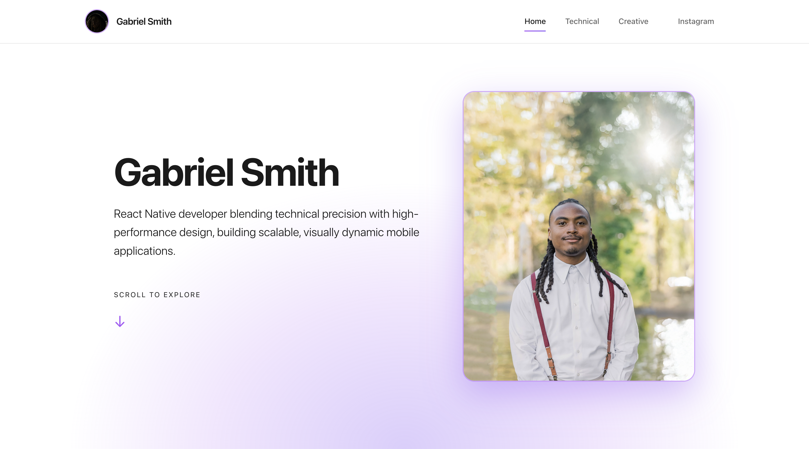

# Gabriel Smith — Personal Portfolio

## 🔗 Visit the Website  
**Live Site:** https://gabeinf.com  
**GitHub Repository:** https://github.com/gabeinf/portfolio-website

---

## Overview

This is my personal portfolio website showcasing my technical work, creative projects, and professional background. Built with a modern, minimal UI, it highlights my experience as a React Native developer and blends clean design with smooth interaction patterns.

The site features dedicated sections for technical case studies, creative media work, and links to my social platforms. It serves as a central hub for recruiters, collaborators, and anyone looking to explore my development journey.

---

## Tech Stack

- **Vite** + **React**  
- **Tailwind CSS**  
- **Framer Motion** (animation)  
- **Responsive UI** for mobile, tablet, and desktop  

---

## Features

- Modern hero layout with a branded visual theme  
- Dedicated sections for technical projects, creative work, and social links  
- Smooth scroll interactions and subtle animations  
- Fully responsive design with scalable components  

---

## Purpose

This portfolio was built to clearly communicate who I am as a developer — blending technical precision with high-performance design, and presenting my projects in a clean, intentional, and visually dynamic way.

